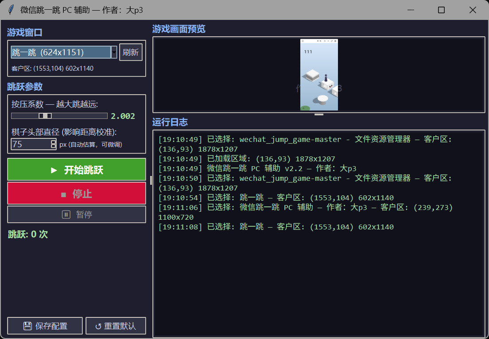

# 微信跳一跳 PC 端自动辅助

> 电脑端微信小程序专用 | 无需手机 | 截图识别 + 鼠标模拟 | 可视化界面

作者：**大p3**

---

## 功能

在 Windows 电脑微信中打开「跳一跳」小程序，本工具自动截取游戏画面、识别棋子和目标块位置、计算距离并模拟鼠标长按完成跳跃。



### 特性

- **可视化 GUI 界面** — 窗口选择、参数调节、实时预览、一键启停
- **命令行脚本** — 轻量无 GUI，适合后台运行或远程桌面
- **自动窗口识别** — 智能检测微信小程序窗口，优先显示疑似目标
- **实时画面预览** — 标注棋子（红）、目标（蓝）、跳跃连线（绿）
- **参数可调** — 按压系数、棋子头部直径实时调节，即时生效
- **随机休息** — 模拟人类操作节奏，降低检测风险
- **配置记忆** — 窗口区域和参数自动保存，下次启动无需重选

---

## 环境要求

| 项目 | 说明 |
|------|------|
| 操作系统 | Windows 10 / 11 |
| Python | 3.8+ |
| 微信 | 桌面端（需能打开「跳一跳」小程序） |
| 依赖 | Pillow, tkinter（Python 自带） |

---

## 快速开始

```bash
# 1. 安装依赖
pip install -r requirements.txt

# 2. 在电脑微信中打开「跳一跳」小程序，进入游戏

# 3. 启动 GUI
python gui_app.py
```

### GUI 操作流程

1. **选择窗口** — 下拉框自动列出所有可见窗口，微信相关窗口优先显示
2. **调整参数** — 按压系数（越大跳越远）、棋子头部直径（影响距离校准）
3. **开始跳跃** — 点击绿色按钮，观察预览画面中的识别标注
4. **保存配置** — 调好参数后点击"保存配置"，下次直接使用

### 命令行模式

```bash
# 交互式 — 选择窗口后自动跳跃
python wechat_jump_auto_pc.py

# 单独选择/更新游戏区域
python select_region.py
```

首次运行会要求选择游戏窗口，之后配置保存在 `config/pc_region.json`，下次自动加载。

---

## 参数说明

| 参数 | 默认值 | 说明 |
|------|--------|------|
| `press_coefficient` | 2.000 | 按压时间系数，越大跳越远。范围 0.5~5.0 |
| `head_diameter` | 自动 | 棋子头部直径（px），影响像素距离到物理距离的换算 |
| `piece_base_height_1_2` | 20 | 棋子底座半高，影响棋子底部定位 |
| `piece_body_width` | 70 | 棋子身体宽度，用于扫描时排除棋子区域 |

> **调参建议**：如果每跳都偏近，加大「按压系数」或减小「棋子头部直径」；偏远则反之。

---

## 文件结构

```
wechat_jump_game-master/
├── gui_app.py              # GUI 主程序（推荐使用）
├── wechat_jump_auto_pc.py  # 命令行版自动跳跃
├── select_region.py        # 游戏区域选择工具
├── pc_config.json          # 参数配置文件
├── requirements.txt        # Python 依赖
├── .gitignore
├── common/
│   ├── pc_control.py       # Windows 截图 + 鼠标模拟 + 窗口枚举
│   └── debug.py            # 调试工具（截图保存、系统信息）
└── config/
    └── pc_region.json      # 游戏窗口区域配置（自动生成）
```

---

## 原理

1. **截图** — `PIL.ImageGrab` 截取游戏窗口客户区
2. **识别棋子** — 按 RGB 范围 (50-60, 53-63, 95-110) 扫描紫色棋子
3. **识别目标** — 按水平方向颜色突变检测目标块边缘
4. **计算距离** — 棋子底部到目标块中心的欧几里得距离
5. **按压时间** — 基于二次公式换算，乘以可调系数
6. **模拟跳跃** — `SendInput` API 在游戏区域内随机位置按下鼠标并保持

---

## 常见问题

**Q: 跳跃距离不准？**
调节「按压系数」和「棋子头部直径」。先用默认参数跳几次观察偏差方向，再微调。

**Q: 找不到微信窗口？**
点击「刷新」按钮重新枚举。如果仍找不到，检查微信窗口是否可见（未被最小化）。

**Q: 识别失败？**
确保游戏窗口未被遮挡，游戏画面完整显示。调整窗口位置后点击「刷新」重新选择。

**Q: 需要重新选择窗口？**
删除 `config/pc_region.json` 或在 GUI 中切换窗口下拉即可。

---

## License

仅供学习交流使用。
